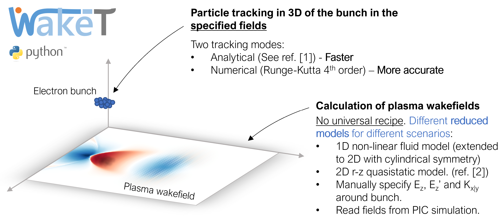

# Wake-T: A fast tracking code for plasma accelerators.
[](https://github.com/AngelFP/Wake-T/actions)
[](https://wake-t.readthedocs.io/en/latest/?badge=latest)
[](https://www.codefactor.io/repository/github/angelfp/wake-t)
[](https://pypi.org/project/Wake-T/)
[](https://github.com/AngelFP/Wake-T/blob/master/LICENSE)


## Overview
 `Wake-T` (**Wake**field particle **T**racker) is a tracking code for laser- and beam-driven plasma wakefield accelerators which aims at providing a fast alternative to Particle-in-Cell (PIC) simulations. Instead of relying on the computationally-expensive PIC algorithm for simulating the plasma wakefields and the beam evolution, `Wake-T` uses a Runge-Kutta solver to track the evolution of the beam electrons in the wakefields, which, at the same time, are computed from reduced models. This allows for a significant speed-up of the simulations, which can be performed in a matter of seconds instead or hours/days. An overview of this strategy can be seen in the following figure:
<p align="center">
  
</p>

In addition to plasma-acceleration stages, `Wake-T` can also simulate active plasma lenses, drifts, dipoles, quadrupoles and sextupoles, allowing for the simulation of complex beamlines. The tracking along the drifts and magnets is performed using second-order transfer matrices, and CSR effects can be included by using a 1D model. This matrix approach and the CSR model are based on a streamlined version of the [`Ocelot`](https://github.com/ocelot-collab/ocelot) implementation.

## Installation

If you don't have Python 3 already installed, download the latest version, for example, from [here](https://www.python.org/downloads/release/python-352/). It is recommended to create a virtual environment for `Wake-T` (you can see how [here](https://docs.python.org/3/library/venv.html), for example). Remember to activate the new environment before proceeding with the installation.

### Installing from PyPI

Simply type
```bash
pip install Wake-T
```
in your terminal.

### Manual installation from GitHub
1) Clone this repository to a directory in your computer using `git`
```bash
git clone https://github.com/AngelFP/Wake-T.git
```
or simply download the code from [here](https://github.com/AngelFP/Wake-T/archive/master.zip) and unzip it.

2) If you haven't already, open a terminal in the newly created folder and perform the installation with
```bash
pip install .
```

## References

[1] - P. Baxevanis and G. Stupakov, *Novel fast simulation technique for axisymmetric plasma wakefield acceleration configurations in the blowout regime*, [Phys. Rev. Accel. Beams **21**, 071301](https://journals.aps.org/prab/abstract/10.1103/PhysRevAccelBeams.21.071301) (2018).

[2] - A. Ferran Pousa et al., *Wake-T: a fast particle tracking code for plasma-based accelerators*, [J. Phys.: Conf. Ser. **1350** 012056](https://iopscience.iop.org/article/10.1088/1742-6596/1350/1/012056) (2019).